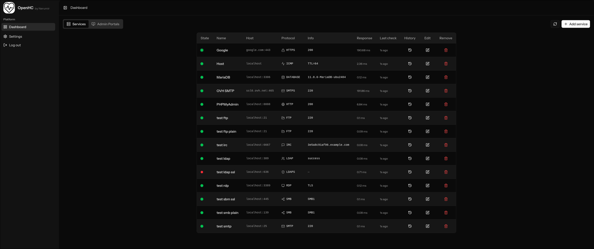
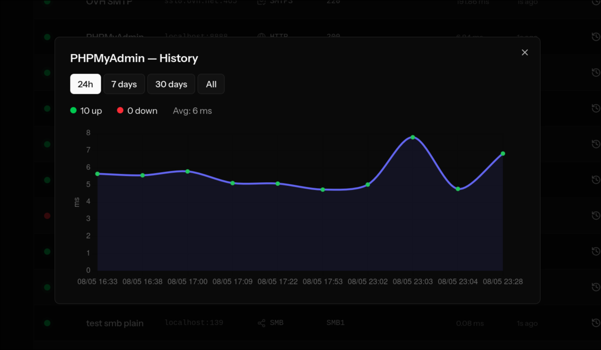
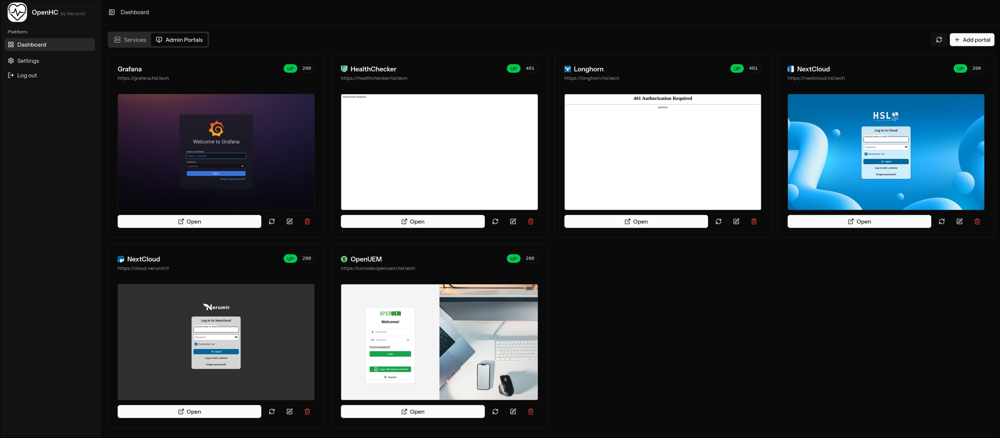
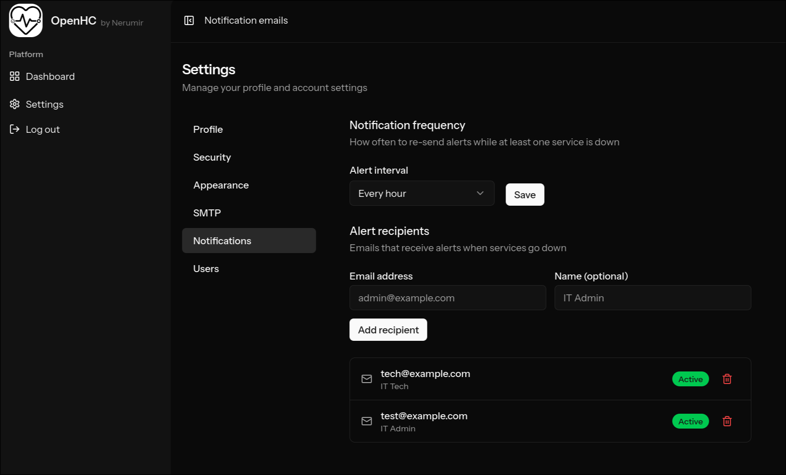

# OpenHC — Open Health Checker

**OpenHC** is a self-hosted service monitoring dashboard.  
It periodically checks the reachability of your servers, websites, and network services, and alerts you by email when something goes down.

---

## Features

- Monitor **TCP, HTTP/HTTPS, SSH, RDP, FTP, SMTP, ICMP, LDAP, SMB, IRC, UDP, Database** endpoints
- Real-time status dashboard updated every 5 minutes
- Admin portal monitoring with HTTP status tracking and screenshots
- Email alerts when services go down (configurable interval, multiple recipients)
- Full CRUD for services and admin portals
- Role-based access: admin + read-only/edit users
- Tiered history pruning — keeps meaningful data long-term without bloating the database

---

## Screenshots

| Services | Service history |
|-----------|---------------|
|  |  |

| Admin portals | Settings |
|---------------|---------|
|  |  |

---

## Repository structure

```
.                          ← deployment repo root
├── app/                   ← Laravel application source
├── Dockerfile
├── docker-compose.yml
├── .env.docker.example    ← config template (committed)
├── .dockerignore
├── Makefile
├── nginx/
│   └── default.conf
├── supervisord.conf
└── entrypoint.sh
```

---

## Requirements

- **Docker** ≥ 24
- **Docker Compose** v2 (bundled with Docker Desktop / `docker compose` plugin)
- `make` (optional but recommended)

---

## How it works

The application code and all assets are **baked into the Docker image** at build time:

1. PHP dependencies are installed via `composer install --no-dev`
2. Front-end assets are compiled via `npm ci && npm run build`
3. Chromium is bundled in the image for portal screenshots (Browsershot)

On each container startup, the entrypoint automatically:

1. Creates any missing `storage/` and `bootstrap/cache/` sub-directories
2. Generates the Laravel `.env` and app key from the variables in `.env.docker`
3. Waits for the database to be ready
4. Runs database migrations
5. Caches config, routes, and views

**Persistence:** only `storage/app/` (uploaded files, portal screenshots) is stored in a named Docker volume — everything else lives in the image.

---

## Deployment

### 1. Clone this repository

```bash
git clone https://github.com/Nerumir/OpenHC.git
cd OpenHC
```

### 2. Configure the environment

```bash
cp .env.docker.example .env.docker
```

Open `.env.docker` and adjust the values:

| Variable | Default | Description |
|---|---|---|
| `APP_PORT` | `8080` | Port exposed on the host |
| `APP_PROTOCOL` | `http` | `http` or `https` — sets `APP_URL` inside the container |
| `APP_DOMAIN` | `localhost` | Hostname or IP (no protocol, no port) |
| `COMPOSE_PROFILES` | `with-db` | `with-db` to deploy MariaDB, **empty** to use an external DB |
| `DB_HOST` | `db` | Database hostname (`db` = the MariaDB container) |
| `DB_PORT` | `3306` | Database port |
| `DB_DATABASE` | `openhc` | Database name |
| `DB_USERNAME` | `openhc` | Database user |
| `DB_PASSWORD` | — | Database password **(change this!)** |
| `DB_ROOT_PASSWORD` | — | MariaDB root password **(change this!)** |

> **HTTPS note:** The container always listens on plain HTTP internally.  
> Set `APP_PROTOCOL=https` and `APP_DOMAIN=monitor.example.com` to generate the correct `APP_URL`, then terminate TLS at a reverse proxy (Nginx Proxy Manager, Caddy, Traefik, Cloudflare Tunnel…) pointed at `APP_PORT`.

### 3. Build and start the stack

```bash
make up
# or without make:
docker compose --env-file .env.docker up -d --build
```

The first build installs all dependencies and compiles assets inside the image (~3–5 min on a cold build). Subsequent builds are faster thanks to Docker layer caching.

### 4. Create the first admin user

Navigate to `http://localhost:8080/register` (or your configured domain/port) to create the first user.

> **The first registered user automatically becomes the admin.**

### 5. Open the app

```
http://localhost:8080          # default
http://your-domain:APP_PORT    # custom
```

---

## Updating the application

Since the code is baked into the image, any code change requires rebuilding the image:

```bash
# Pull the latest code
git pull

# Rebuild the image and restart
make up
```

---

## Useful commands

| Command | Description |
|---|---|
| `make up` | Build the image and start the stack |
| `make down` | Stop and remove containers |
| `make rebuild` | Force recreate containers |
| `make logs` | Tail live logs |
| `make shell` | Open a shell in the app container |
| `make migrate` | Run pending migrations |
| `make seed` | Run database seeders |
| `make fresh` | Drop all tables and re-run migrations (⚠ destroys data) |
| `make artisan CMD="..."` | Run any Artisan command |
| `make uninstall` | ⚠️ Remove containers, images, volumes and networks (destroys all data) |

Raw equivalents (no `make`):

```bash
docker compose --env-file .env.docker exec app php artisan migrate --force
docker compose --env-file .env.docker exec app php artisan tinker
docker compose --env-file .env.docker logs -f app
```

---

## Architecture

```
┌─────────────────────────────────────────┐
│              openhc_net (bridge)        │
│                                         │
│  ┌────────────────────┐  ┌───────────┐  │
│  │      app           │  │    db     │  │
│  │  nginx + php-fpm   │  │  MariaDB  │  │
│  │  schedule:work     │◄─┤  (opt.)   │  │
│  └────────┬───────────┘  └───────────┘  │
│           │ :80 (internal)              │
└───────────┼─────────────────────────────┘
            │ host:APP_PORT
            ▼
        Browser / Reverse proxy
```

- The application code is **baked into the image** — no bind-mount.
- **`storage/app/`** (uploads, screenshots) is persisted in the `app_storage` named volume.
- **MariaDB** is on the internal bridge network only — never exposed to the host.
- The **scheduler** (`schedule:work`) runs inside the app container and fires `services:check` every 5 minutes and `services:prune-history` nightly at 03:00.
- Database data is persisted in the `db_data` named Docker volume.

---

## Data retention policy

Service check history is pruned automatically every night at 03:00:

| Period | Records kept |
|--------|-------------|
| Last 24 h | 100 (≈ 1 per 14 min) |
| 1 d – 7 d | 12 / day |
| 7 d – 30 d | 4 / day |
| 30 d – 1 year | 0.3 / day (≈ 1 per 3.3 days) |
| > 1 year | 1 / month |

---

## License

GNU General Public License v3.0 — see [LICENSE](LICENSE) for details.
